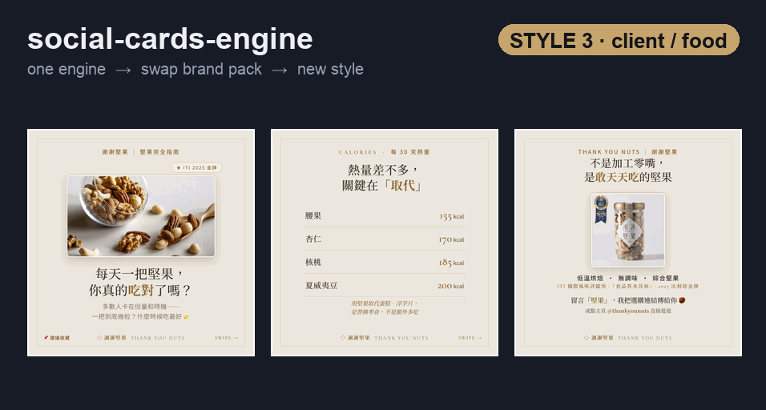
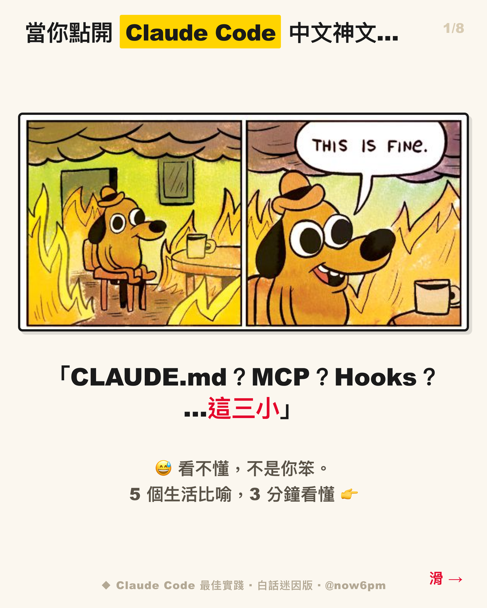
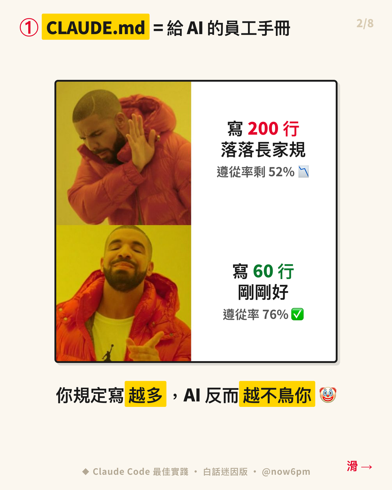
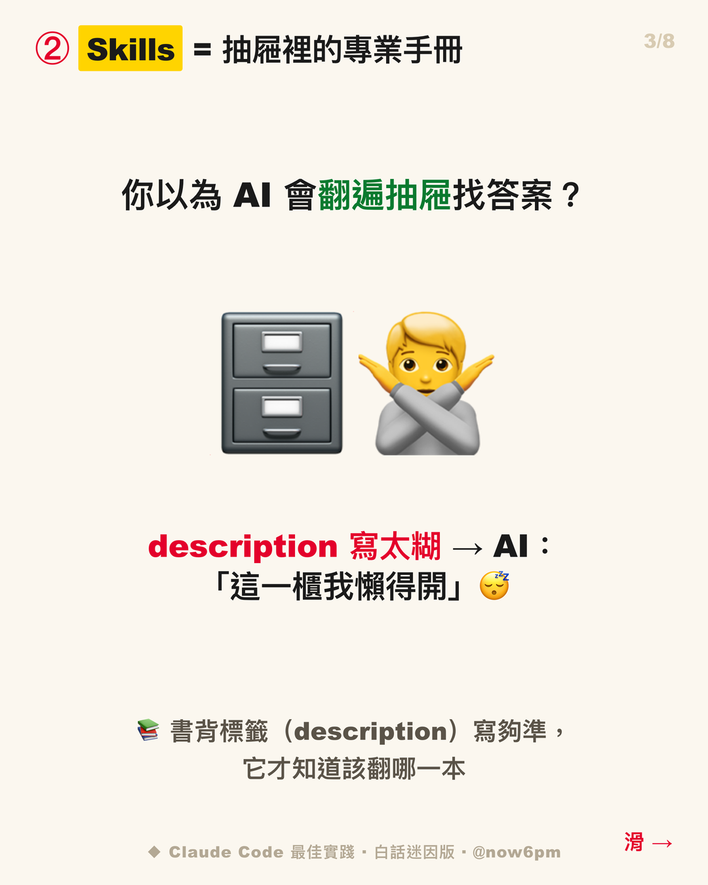
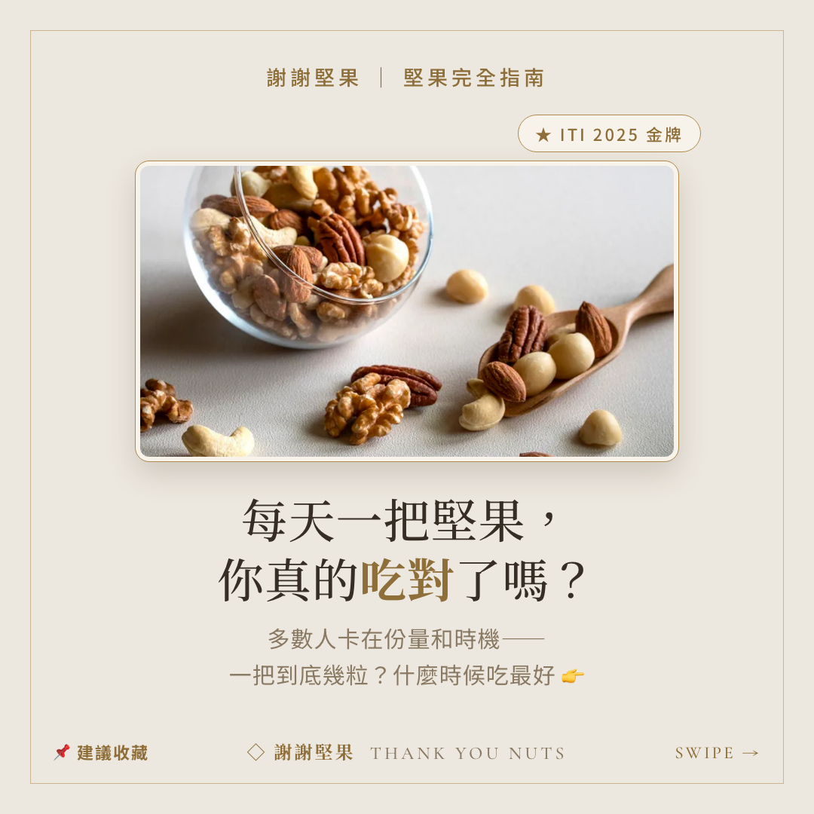
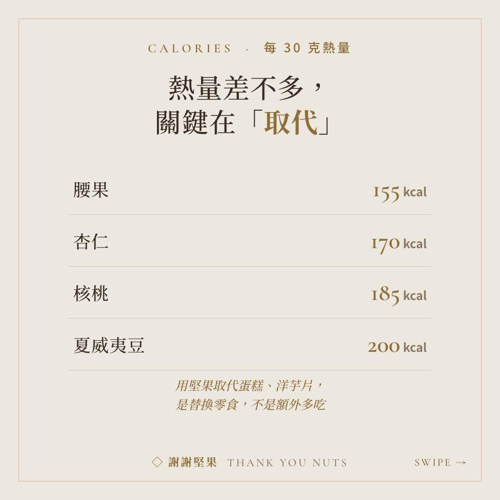
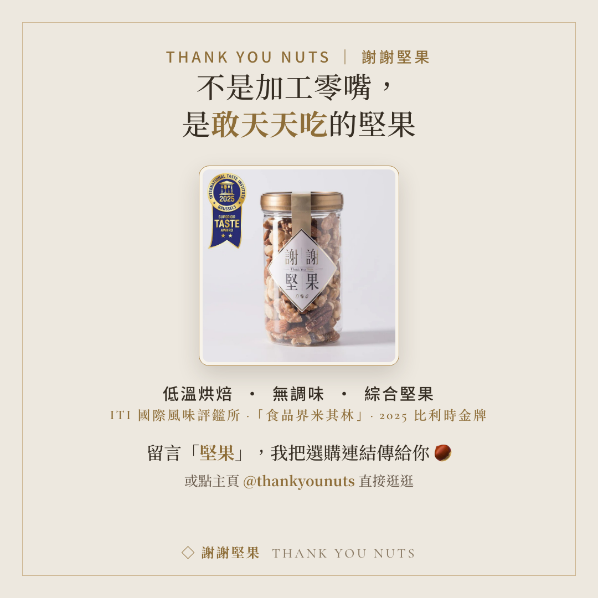

<div align="center">

# social-cards-engine

### The Claude Design for IG carousels · IG 圖卡版的 Claude Design

**One engine. Swap a brand pack. A whole new style.**
**一套引擎，換一份 brand pack，換一種風格。**

From navy poster to street meme to a premium food brand — every card comes out unmistakably *you*.
從藍焰海報、鄉民迷因到精品食品風 —— 每張圖卡都長成「你」的樣子，還內建 AI 審稿員把關擴散。

[](LICENSE)


**[English](#english)** · **[繁體中文](#繁體中文)**



<sub><b>One engine → swap the brand pack → a completely different style.</b><br/>同一套引擎，換一份 brand pack ＝ 換一種風格。</sub>

<br/><br/>

<p align="center">
  
  
  
</p>

<sub><code>now6pm</code> pack — navy poster style · 藍焰海報風</sub>

<p align="center">
  
  
  
</p>

<sub><code>meme</code> pack — casual street style · 鄉民迷因風（same engine, another pack · 同一引擎，另一份 pack）</sub>

<p align="center">
  
  
  
</p>

<sub><code>thankyounuts</code> pack — real client, warm-gold food style · 真實客戶案，暖米金精品食品風（1:1 square · 方形版）</sub>

</div>

---

<a name="english"></a>

## English

### The problem

The painful part of social cards isn't making *one* — it's making every card look **consistent**, then having to **start over** for the next brand.

- 5 clients = 5 style systems crammed in your head
- Meme style today, luxury style tomorrow = redo everything
- You can make the card, but you **can't tell if it'll spread or even looks good**

This engine moves "style" out of your head and into **one file**. Like a brand kit — every card grows out of that file.

### Core concept: one kitchen, many recipes

| Part | What it is | Swappable? |
|---|---|---|
| **Engine** | The kitchen + tools (HTML → screenshot → 1080px cards) | Fixed |
| **Brand pack** | The recipe + seasoning (palette / fonts / sizing / voice) | **One per brand** |
| **Joker** | The independent taster (scores every card before ship, rejects fails) | Fixed |

> One engine serves solo KOLs, brand editors, and client work — each looks different, all cooked in the same kitchen.

### How it works

```
Your topic / article
      │
      ▼   1. Pick a brand pack (your style file)
      ▼   1.5 Align first — huashu-design mocks ONE cover card: "is this the look?"
             (lock the style, then mass-produce · skip if you already have a pack)
   [ engine ] ──▶ split cards → HTML template → Chrome screenshot → a row of PNGs
      │
      ▼   2. Send to a joker for one review pass (structure / spread / humor, item-by-item PASS·FAIL)
   fail → revise per feedback → re-review  (max 3 rounds, then escalate — no "take the highest score")
      │
      ▼   3. Finalize
   a row of cards that look like you AND are built to spread
```

### Who it's for

- **Solo creators / KOLs** — a recognizable personal look; every post feels made by the same hand
- **Brand editors / agencies** — one engine, many clients, one pack each, no mental context-switching
- **Content creators** — turn an article or tutorial into a spread-ready carousel

### What you get

| | Plain English |
|---|---|
| **Card engine** | topic / article → a carousel of cards (HTML+CSS → Chrome headless → PNG) |
| **Starter templates** | navy poster / warm Morandi / warm-earth ELI5 |
| **Brand pack architecture** | the "one brand, one pack" folder convention + how to add your own |
| **Spread methodology** | 8–10 card structure templates + rules that make content get *saved* and *shared* |
| **Asset intake gate** | brand character / logo → a cutout QA pipeline: zero white-halo on any background, machine-verified (`scripts/asset_prep.py` + `halo_check.py`) |
| **Image sourcing (copyright-first)** | need a photo or meme? auto-fetch candidates **with attribution** — CC / public-domain first (Openverse → Wikimedia, no key), optional Unsplash / Pexels, meme templates flagged for copyright; every image is logged with source + license so **you pick / swap**, the engine never silently uses one (`scripts/fetch_image.py`) |
| **Design alignment gate** | before mass-producing, mock up **one cover card** so you confirm *"is this the look?"* — lock the style, then render the rest. No more rendering 12 cards in the wrong style and starting over (uses `huashu-design` if installed; otherwise the engine renders one real cover card for the same check) |
| **Brand character pack guide** | a drop-in prompt + the intake gate to fuse your mascot into every card |
| **Two AI reviewers** | `carousel-joker` (knowledge posts), `meme-joker` (memes — turns "funny" into checkable criteria) |
| **Built-in meme pack** | white-bg Impact street style (with a copyright caution) |

### Why a "reviewer"?

Good content ≠ spreads, and pretty ≠ funny. So before shipping, every card passes an **independent, nitpicky, no-flattery** AI reviewer:

- **carousel-joker** — knowledge posts: is the cover a hook or just a category name? Is there a cheat-sheet card? Does the CTA say "send this to someone"?
- **meme-joker** — memes: readable in 1 second? Is there contrast? Does it hit a real pain point? (Humor as a scorable checklist.)

Fail → revise → re-review until it passes. **The writer ≠ the reviewer.**

Hard signals (card count, 1080×1350 size, hashtag count, font size) are checked by a script — see `skills/carousel-joker/hard_checks.py` — so the joker only spends judgment on the subjective calls.

### Recommended companions (optional, auto-detected)

This engine focuses on **make cards + structure + review**. These two skills run fine without it, and level it up when installed — Claude uses them automatically if present:

| Companion | What you gain | Without it |
|---|---|---|
| **`huashu-design`** (HTML design skill) | layout QA: centered undistorted images, whitespace rhythm, overflow/clip checks, tidy IG layout | you eyeball layout yourself; small overflows and bad crops slip through |
| **[`social-post`](https://github.com/Hao0321/claude-skill-social-post)** | 2026 algorithm signal weights (sends > saves > likes) as the spread yardstick + semi-auto posting (FB / IG / Threads) + learns your voice | just images; you write captions, post by hand, guess at spread |

> The engine's spread rules stand on `social-post`'s algorithm research; the aesthetic QA leans on `huashu-design`. All three = **make it · lay it out · ship it · and it spreads**.

**Install both companions (from their official repos):**

```bash
bash scripts/install_companions.sh        # clones them into ~/.claude/skills/
```

> This repo **bundles nothing** — the script just `git clone`s each skill from its **official source**, so you get it directly from the author under the author's own license.
> ⚠️ **`huashu-design` is under a Personal Use License** (© alchaincyf / 花叔): free for personal / non-commercial use; **company, team, client-delivery or commercial use needs the author's written permission** (see its LICENSE). The engine stays fully usable **without** it — the design-alignment gate falls back to an engine-rendered cover card.

### Quick start (you *talk*, you don't write Python)

> This is a **Claude Code skill** — you chat with Claude and it makes the cards. Python 3 + Chrome are just the render dependency Claude calls for you.

```
1. Install the skill: drop this repo into Claude's skills (~/.claude/skills/social-cards)
2. Tell Claude: "use social-cards to turn this article into IG cards"
3. First run it asks which path:
   - use a preset style? (navy poster / warm Morandi / warm-earth ELI5 / street meme)
   - or co-create your own style, like a brand kit interview
     (it interviews you, or you paste a few posts / your site / a deck, and it reverse-engineers your brand pack)
4. a row of cards → joker review pass → finalize
```

<details><summary>Advanced: run the render script yourself (optional)</summary>

```bash
# Needs macOS + Google Chrome + Python 3 (only for the "render to PNG" step)
git clone https://github.com/DennisWei9898/social-cards-engine
python3 brands/<your-brand>/render_template.py   # after editing the CARDS content
```
Claude runs this line for you behind the scenes — you don't have to.
</details>

### Meme copyright (read first)

- This repo ships **no meme image files** — classics (Drake / This is fine / Pikachu…) are **mostly still copyrighted**, and public redistribution infringes.
- Grab clean templates from [imgflip](https://imgflip.com/memetemplates) / [memes.tw](https://memes.tw) into `memes/` — or let the engine fetch them **with source + copyright note**: `python3 scripts/fetch_image.py "drake" --meme --out brands/meme/memes`.
- **Personal, non-commercial** is lower risk; **brand / client work** should use **original art** or **licensed** assets (`meme-joker` fails any brand job that uses a copyrighted meme).

### License

MIT — modify, use, commercialize freely; keep the license notice.

---

<a name="繁體中文"></a>

## 繁體中文

### 為什麼需要它

做社群圖卡最痛的不是「做一張」，是每一張都要長得**一致**，換個品牌又得**打掉重做**。

- 幫 5 個客戶做圖 = 5 套風格塞在腦子裡
- 今天想試迷因風、明天想試精品風 = 重來一次
- 圖做得出來，但**不知道會不會擴散、好不好看**

這個引擎把「風格」從你的腦袋，搬進**一個檔案**。就像 brand kit —— 每張圖卡都從那個檔案長出來。

### 核心概念：一個廚房，很多食譜

| 角色 | 是什麼 | 換不換 |
|---|---|---|
| **引擎** | 廚房 + 鍋具（HTML → 截圖出 1080 圖卡）| 固定，不換 |
| **brand pack** | 食譜 + 調味（配色 / 字體 / 尺寸 / 語氣）| **換品牌就換一份** |
| **joker** | 獨立試吃員（出圖前逐條打分、不合格退回）| 固定 |

> 一套引擎，服務個人 KOL、品牌小編、客戶案 —— 每個都長不一樣，但都出自同一個廚房。

### 30 秒看懂運作

```
你的主題 / 文章
      │
      ▼   1. 選一個 brand pack（你的風格檔）
      ▼   1.5 先對焦 —— huashu-design 產「一張封面卡樣」：「要長這樣嗎？」
             （確認後鎖定風格再量產・已有 pack 可跳過）
   [ 引擎 ] ──▶ 拆卡 → HTML 模板 → Chrome 截圖出一排 PNG
      │
      ▼   2. 丟給 joker 審一輪（結構 / 擴散 / 幽默，逐條 PASS·FAIL）
   不過 → 照建議改 → 再審（最多 3 輪，不過即上報，不「取最高分」矇混）
      │
      ▼   3. 定版
   一排「長得像你、又會擴散」的 IG 輪播圖卡
```

### 給誰用

- **個人 KOL / 自媒體** —— 建立一眼認得出的個人視覺，每篇都像同一個人做的
- **品牌小編 / 代理商** —— 一個引擎服務多客戶，每個客戶掛一個插件，不再腦內切換
- **內容創作者** —— 把文章 / 教學一鍵變成會擴散的輪播

### 你會拿到

| | 白話 |
|---|---|
| **圖卡引擎** | 主題 / 文章 → 一排輪播圖卡（HTML+CSS → Chrome headless → PNG）|
| **通用模板** | navy / 暖色 Morandi / 暖大地 ELI5 幾套起手式 |
| **brand pack 架構** | 「一品牌一插件」的資料夾約定 + 怎麼新增你自己的品牌 |
| **擴散方法論** | 8–10 張的結構模板 + 讓內容「被存、被傳」的規則 |
| **資產入庫閘（去背 QA 管線）** | 品牌人物／logo → 任何底色零白暈、機器可驗的去背管線（`scripts/asset_prep.py` + `halo_check.py`）|
| **自動找圖（版權優先）** | 需要照片／迷因時**自動抓候選＋附出處**——先 CC／公眾領域（Openverse → Wikimedia，免 key），選用 Unsplash／Pexels，迷因附版權提醒；每張記來源＋授權，**引擎不自動採用、交你挑或換來源**（`scripts/fetch_image.py`）|
| **設計對焦閘** | 量產前先產**一張封面卡樣**，你確認「**要長這樣嗎**」再鎖風格、量產其餘——不再整套 12 張渲錯風格才打掉重做（有裝 `huashu-design` 就用它發散；沒裝則引擎渲一張真封面卡對焦）|
| **品牌角色包引導** | 一組標準 prompt ＋ 入庫閘，把你的吉祥物融進每一張圖卡 |
| **兩個 AI 審稿員** | `carousel-joker`（正經知識型）、`meme-joker`（迷因型，把「好笑」拆成可判定的要素）|
| **內建迷因 pack** | 白底黃黑紅 Impact 鄉民風（附版權提醒）|

### 為什麼要「審稿員」

好內容 ≠ 會擴散，好看 ≠ 好笑。所以出圖前先過一關**獨立、專門找碴、禁止客套**的 AI 審稿員：

- **carousel-joker** —— 正經知識型：封面是鉤子還是類目？有沒有速查卡？CTA 有沒有「傳給某人」？
- **meme-joker** —— 迷因型：1 秒看懂嗎？有反差嗎？切身痛點嗎？（把「幽默感」變成可打分的清單）

不合格就退回改，改到過為止。**寫的人 ≠ 審的人。**

機器可判的硬訊號（張數、1080×1350 尺寸、hashtag 數、字級）由腳本自動判 —— 見 `skills/carousel-joker/hard_checks.py` —— 讓 joker 只把判斷力花在主觀項。

### 推薦搭配安裝（選用，自動偵測）

這個引擎專心做「**產圖 + 結構 + 審稿**」。以下兩個 skill **沒裝也能跑，裝了自動加分** —— Claude 偵測到有裝就會用：

| 搭配 skill | 裝了得到什麼 | 沒裝會怎樣 |
|---|---|---|
| **`huashu-design`**（花叔 Design · HTML 設計 skill）| 出圖前後的**版面 QA**：圖片置中不變形、留白節奏、跑版／溢出檢查、IG 排版顧到位 | 版面得自己盯，容易小跑版、圖被裁壞 |
| **[`social-post`（Hao0321）](https://github.com/Hao0321/claude-skill-social-post)** | **2026 演算法訊號權重**（私訊分享 > 收藏 > 讚）當擴散量尺 ＋ **半自動發文**（FB／IG／Threads）＋ 學你的貼文語氣 | 只有圖，得自己想文案、手動發、憑感覺猜擴散 |

> 本引擎的**擴散規則**站在 `social-post` 的演算法研究肩膀上；**美感 QA** 靠 `huashu-design`。三個一起裝 ＝「**做得出圖 · 看得順版 · 發得出去 · 還會擴散**」的完整一條龍。

**一鍵安裝兩個伴生 skill（從官方 repo 裝）：**

```bash
bash scripts/install_companions.sh        # clone 到 ~/.claude/skills/
```

> 這個 repo **不打包任何別人的作品** —— 腳本只是幫你從各 skill 的**官方來源** `git clone`，你是直接向作者取得、依作者授權使用。
> ⚠️ **`huashu-design` 為 Personal Use License**（© alchaincyf／花叔）：個人／非商用免費；**公司、團隊、客戶交付、商用須先向作者取得書面授權**（見其 LICENSE）。**沒裝也完全能用**——設計對焦閘會退回「引擎渲一張真封面卡」的做法。

### 快速開始（你用「講」的，不寫 Python）

> 這是一個 **Claude Code skill** —— 你跟 Claude 對話，它幫你出圖。Python 3 + Chrome 只是引擎渲染那步、Claude 會自己呼叫的相依工具，你不用手動跑。

```
1. 安裝 skill：把這個 repo 放進 Claude 的 skills（~/.claude/skills/social-cards）
2. 跟 Claude 說：「用 social-cards 幫我把這篇文章做成 IG 圖卡」
3. 第一次它會問你要哪條：
   · 用預設風格？（navy 海報 / 暖色 Morandi / 暖大地 ELI5 / 迷因鄉民）
   · 還是跟我「聊」出你自己的風格？（訪談你，或你貼幾篇貼文/官網/簡報，我拆解成你的 brand pack）
4. 出一排圖卡 → joker 審一輪 → 定版
```

<details><summary>進階：想自己手動跑渲染腳本（選用）</summary>

```bash
# 需要 macOS + Google Chrome + Python 3（僅「渲染成 PNG」那步用到）
git clone https://github.com/DennisWei9898/social-cards-engine
python3 brands/<你的品牌>/render_template.py   # 改掉 CARDS 內容後
```
Claude 平常就是在背後幫你跑這一行 —— 你不用自己來。
</details>

### 迷因梗圖的版權（請先讀）

- 本 repo **不含任何梗圖檔** —— 經典梗（Drake / This is fine / Pikachu…）**大多仍有版權**，公開散布會侵權。
- 自己去 [imgflip](https://imgflip.com/memetemplates) / [memes.tw](https://memes.tw) 抓乾淨模板放進 `memes/`——或讓引擎**自動抓＋附出處與版權提醒**：`python3 scripts/fetch_image.py "drake" --meme --out brands/meme/memes`。
- **個人非商用**風險較低；**品牌 / 客戶案**請改**自繪原創**或**買授權**（`meme-joker` 會直接把用版權梗的品牌案判 FAIL）。

### 授權

MIT License —— 自由修改、使用、商用，保留授權標註即可。

---

<div align="center">

### 想合作？ / Let's work together

Brand content automation, social card pipelines, or just talking AI workflows —
打造品牌內容自動化、社群圖卡 pipeline，或想聊 AI 工作流 —

**dennis.xd.wei@gmail.com** · **[LinkedIn](https://www.linkedin.com/in/dennis-wei-47393a14a/)**

</div>
