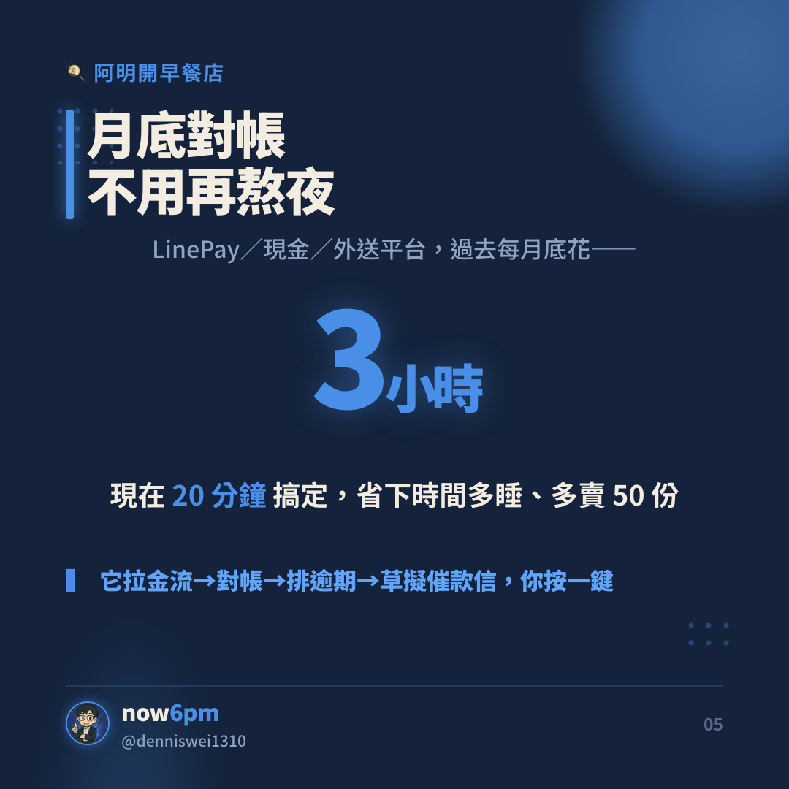

<div align="center">

# 🎨 social-cards-engine

### 任何品牌、任何 KOL，都能擁有「自己風格」的社群圖卡

**一套引擎 × 換一個品牌插件 = 換一種風格。**
你的配色、你的字體、你的語氣——出圖自動長成「你」的樣子。

`品牌無關的圖卡引擎` · `一品牌一插件` · `內建 AI 審稿員`

</div>

---

## 為什麼需要它

做社群圖卡最痛的不是「做一張」，是——

> 每一張都要長得**一致**，換個品牌又得**打掉重做**。

- 幫 5 個客戶做圖 = 5 套風格塞在腦子裡 😵
- 今天想試迷因風、明天想試精品風 = 重來一次
- 圖做得出來，但**不知道會不會擴散、好不好看** 🤷

這個引擎把「風格」從你的腦袋，搬進**一個檔案**。
就像 Claude Design 把品牌變成一份 brand kit——**每張圖卡都從那個檔案長出來**。

---

## 💡 核心概念：一個廚房，很多食譜

| | 是什麼 | 換不換 |
|---|---|---|
| 🍳 **引擎** | 廚房 + 鍋具（HTML→截圖出 1080 圖卡）| 固定，不換 |
| 📖 **brand pack** | 食譜 + 調味（配色 / 字體 / 尺寸 / 語氣）| **換品牌就換一份** |
| 🧑‍⚖️ **joker** | 獨立試吃員（出圖前逐條打分、不合格退回）| 固定 |

> 結論：**一套引擎，服務個人 KOL、品牌小編、客戶案——每個都長不一樣，但都出自同一個廚房。**

---

## 🎬 實例：now6pm（一個真實品牌長出來的樣子）

> `now6pm` 是用這套引擎做的個人品牌 pack——**navy 藍焰・超大粗標・電光藍點睛・尾部頭像品牌標**。
> 同一套引擎，換一份 brand pack 就是另一種風格（食品客戶就長成暖米金明體）。

<p align="center">
  
  
  
</p>

📱 **看實際發文效果** → [Instagram 完整 9 張輪播](https://www.instagram.com/p/DaQYu2WgU-J/)

---

## 👥 給誰用

- 🧑‍💻 **個人 KOL / 自媒體** — 建立一眼認得出的個人視覺，每篇都像同一個人做的
- 🏢 **品牌小編 / 代理商** — 一個引擎服務多客戶，每個客戶掛一個插件，不再腦內切換
- ✍️ **內容創作者** — 把文章 / 教學一鍵變成會擴散的輪播

---

## 🚀 30 秒看懂運作

```
你的主題 / 文章
      │
      ▼   ① 選一個 brand pack（你的風格檔）
   [ 引擎 ] ──▶ 拆卡 → HTML 模板 → Chrome 截圖出一排 PNG
      │
      ▼   ② 丟給 joker 審一輪（結構 / 擴散 / 幽默，逐條 PASS·FAIL）
   不過 → 照建議改 → 再審
      │
      ▼   ③ 定版
   一排「長得像你、又會擴散」的 IG 輪播圖卡 ✨
```

---

## 📦 你會拿到

| | 白話 |
|---|---|
| **圖卡引擎** | 主題 / 文章 → 一排輪播圖卡（HTML+CSS → Chrome headless → PNG）|
| **通用模板** | navy / 暖色 Morandi / 暖大地 ELI5 幾套起手式 |
| **brand pack 架構** | 「一品牌一插件」的資料夾約定 + 怎麼新增你自己的品牌 |
| **擴散方法論** | 8–10 張的結構模板 + 讓內容「被存、被傳」的規則 |
| **兩個 AI 審稿員** | `carousel-joker`（正經知識型）、`meme-joker`（迷因型，把「好笑」拆成可判定的要素）|
| **內建迷因 pack** | 白底黃黑紅 Impact 鄉民風（附版權提醒）|

---

## 🧑‍⚖️ 為什麼要「審稿員」

好內容 ≠ 會擴散，好看 ≠ 好笑。所以出圖前先過一關**獨立、專門找碴、禁止客套**的 AI 審稿員：

- **carousel-joker** — 正經知識型：封面是鉤子還是類目？有沒有速查卡？CTA 有沒有「傳給某人」？
- **meme-joker** — 迷因型：1 秒看懂嗎？有反差嗎？切身痛點嗎？（把「幽默感」變成可打分的清單）

不合格就退回改，改到過為止。**寫的人 ≠ 審的人**。

---

## 🤝 兩個「好朋友」（推薦搭配安裝）

這個引擎專心做「產圖 + 結構」。另外兩塊裝了體驗更完整：

- 🎨 **美感 / 版面 → 推薦裝 `huashu-design`（HTML 設計 skill）** — 幫你把圖置中、不變形、IG 排版顧到位。
- 📈 **演算法 + 半自動發文 → 推薦裝 [Hao0321 的 `social-post`](https://github.com/Hao0321/claude-skill-social-post)** — 內含 2026 社群演算法訊號權重（私訊分享 > 收藏 > 讚）與半自動發文。本引擎的擴散規則就站在它肩膀上。

---

## ⚡ 快速開始（你用「講」的，不寫 Python）

> 這是一個 **Claude Code skill**——你跟 Claude 對話，它幫你出圖。
> Python 3 + Chrome 只是**引擎渲染圖片那一步、Claude 會自己呼叫的相依工具**，你不用手動跑。

```
1. 安裝 skill：把這個 repo 放進 Claude 的 skills（~/.claude/skills/social-cards）
2. 跟 Claude 說：「用 social-cards 幫我把這篇文章做成 IG 圖卡」
3. 第一次它會問你要哪條：
   · 用預設風格？（navy 海報 / 暖色 Morandi / 暖大地 ELI5 / 迷因鄉民）
   · 還是像 Claude Design 一樣，跟我「聊」出你自己的風格？
     —— 訪談你，或你貼幾篇貼文/官網/簡報，我拆解成你的 brand pack
4. 出一排圖卡 → joker 審一輪 → 定版
```

<details><summary>進階：想自己手動跑渲染腳本（選用）</summary>

```bash
# 需要 macOS + Google Chrome + Python 3（僅「渲染成 PNG」那步用到）
git clone https://github.com/DennisWei9898/social-cards-engine
python3 brands/<你的品牌>/render_template.py   # 改掉 CARDS 內容後
```
Claude 平常就是在背後幫你跑這一行——你不用自己來。
</details>

---

## ⚠️ 迷因梗圖的版權（請先讀）

- 本 repo **不含任何梗圖檔**——經典梗（Drake / This is fine / Pikachu…）**大多仍有版權**，公開散布會侵權。
- 自己去 [imgflip](https://imgflip.com/memetemplates) / [memes.tw](https://memes.tw) 抓乾淨模板放進 `memes/`。
- **個人非商用**風險較低；**品牌 / 客戶案**請改**自繪原創**或**買授權**（`meme-joker` 會直接把用版權梗的品牌案判 FAIL）。

---

## 📄 授權

MIT License — 自由修改、使用、商用，保留授權標註即可。

---

<div align="center">

## 🤝 想合作？

打造品牌內容自動化、社群圖卡 pipeline，或想聊 AI 工作流 —

**✉️ dennis.xd.wei@gmail.com**　·　**💼 [LinkedIn](https://www.linkedin.com/in/dennis-wei-47393a14a/)**

</div>
